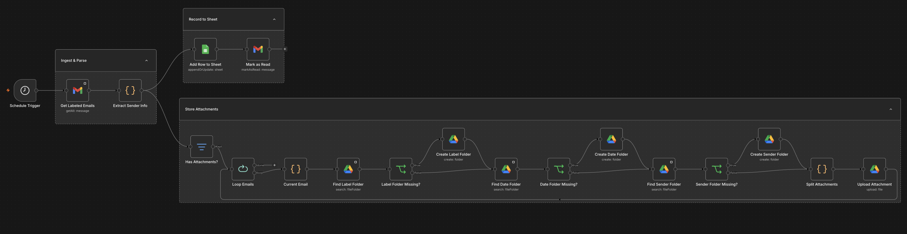
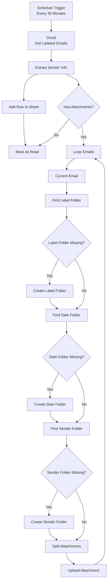

# n8n Multi-Label Gmail to Google Sheets & Drive Automation

## Overview
This workflow automates the processing of incoming emails under monitored Gmail labels.
Every 30 minutes, the workflow checks Gmail for new messages matching the configured label, extracts important email metadata, detects attachments, archives those attachments into a structured Google Drive hierarchy, records one row per email in Google Sheets, and marks successfully processed Gmail messages as read

## Workflow


## Diagram Flowchart


## Features
- Gmail label-based email processing
- Email metadata extraction
- Automatic attachment archiving
- Structured Google Drive folders
- Google Sheets logging
- Duplicate folder prevention
- Scheduled processing

## Archive Structure

```text
<label>/<date>/<sender>/
```

### Example

```text
Receipts/
└── 2026-09-07/
    └── Sender Name/
        └── receipt.pdf
```

## Tech Stack

- n8n
- Google Authentication
- Google Drive
- Google Sheets
- JavaScript

### Tools

[](https://n8n.io/)
[](https://www.google.com/)
[](https://drive.google.com/)
[](https://sheets.google.com/)
[](https://developer.mozilla.org/en-US/docs/Web/JavaScript)
