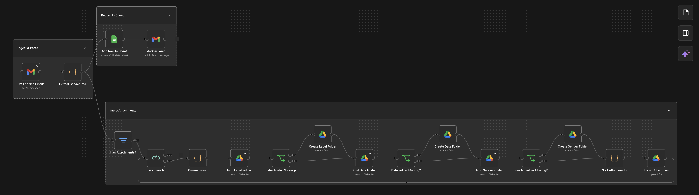
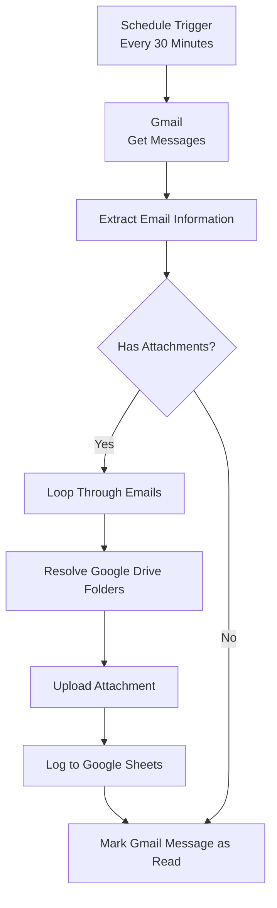

# n8n Multi-Label Gmail to Google Sheets & Drive Automation

## Overview
This workflow automates the processing of incoming emails under monitored Gmail labels.
Every 30 minutes, the workflow checks Gmail for new messages matching the configured label, extracts important email metadata, detects attachments, archives those attachments into a structured Google Drive hierarchy, records one row per email in Google Sheets, and marks successfully processed Gmail messages as read

## Workflow

## Diagram Flowchart

